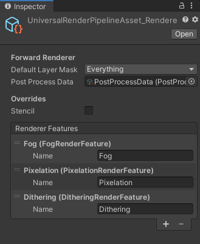
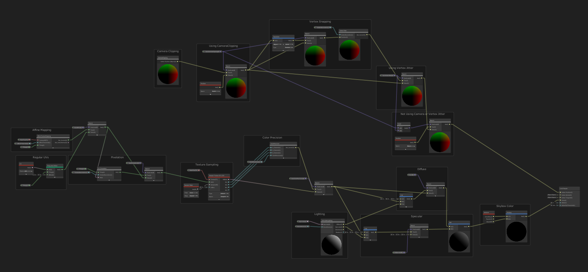

# URP-PSX

Playstation 1 era retro graphics plugin optimized for Unity's Universal Rendering Pipeline with Shadergraph. The aim of this plugin was to use Unity's new pipeline to create NPR (non-photorealistic) PSX-style retro graphics with the shadergraph as the basis for materials and URP's render features as the basis for post processing effects.

### Features

The plugin comes fully-featured with a single lit/unlit graph where you can enable/disable features according to your needs (and even modify them). I segmented every feature into a subgraph to hopefully make it easier to just plug n' play. 

### Shadergraph:
- Lit/Unlit shader variants
- Specular Lit variant
- Camera-based vertex clipping
- Vertex snapping/Jittering
- Texture Pixelation for crushing texture resolution
- Color Precision for lower or higher color Fidelity

### URP Render Features:
- Screen-space fog 
- Screen-space pixelation/color precision adjustments
- Screen-space dithering 

*Note: Make sure you set the render features in the pipeline asset*

### The Graph

### Compatibility

Unity 2019.3.7f1
Universal Rendering Pipeline/Shadergraph (7.1.8)

### Known Issues

- Unity's Shadergraph still has a long way to go when it comes to creating NPR effects. You might experience some lighting clipping issues if you are using the PBR master node. To fix it, I tweaked some settings in the URP pipeline asset settings so they are barely noticeable. 

### References

- [Models open-source from sketchfab](https://sketchfab.com/)
- [t-macnaga for render feature post-process](https://github.com/t-macnaga/UniversalRPPostProcessing)
- [Alex Lindman for custom lighting nodes](https://blogs.unity3d.com/2019/07/31/custom-lighting-in-shader-graph-expanding-your-graphs-in-2019/)
- [UnityRenderingExamples for render feature implementation](https://github.com/Unity-Technologies/UniversalRenderingExamples)
- [Ciro Continision for PBR master node custom lighting implementation](https://connect.unity.com/p/zelda-inspired-toon-shading-in-shadergraph)

### License 

Open-source, use for whatever you want!!! Software is about freedom :) 

### Support 

I developed this plugin out of passion/nostalgia for retro ps1-style horror games. But, if you found this plugin useful and want to show your support, consider sharing it,[buying me a ko-fi](https://ko-fi.com/kodrin). 
